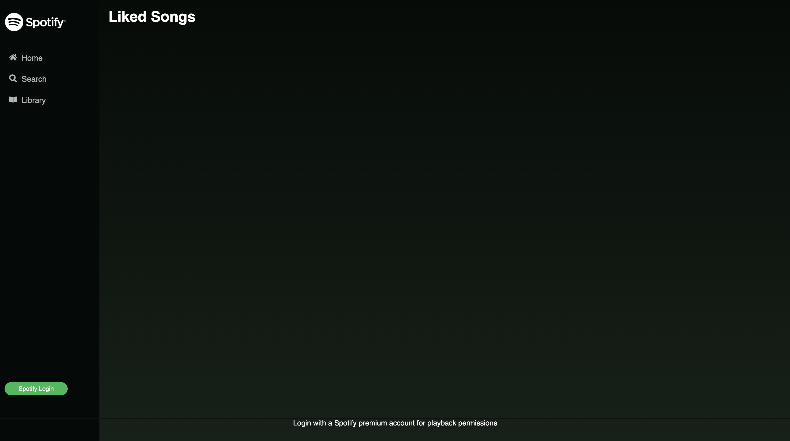
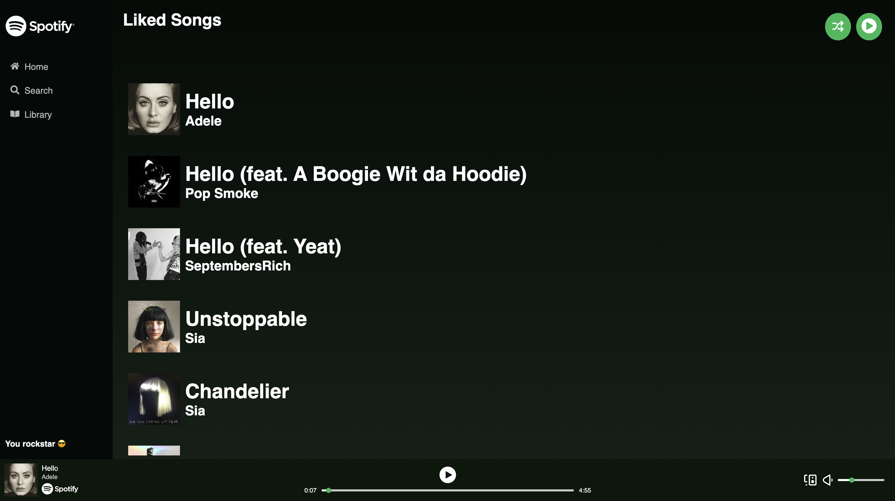

# Front-end Spotify Clone

This project utilizes the Spotify API to create a web-based Spotify "clone." Users of this application will be able to freely browse Spotify's catelogue of artists, tracks, albums, audiobooks, and more. Users with premium Spotify accounts will be able to login with their account using Spotify authentication to then be able to have additional permissions such as playing songs or even entire albums. This application captures the primary functionality of Spotify-actual, with several exceptions in terms of scope of features and accessibility.

## Free Account Permissions

Without logging in, users will be able to freely search through Spotify's catelogue. Unfortunately, without logging in, users will experience a significantly downgraded version of the application. 

## Free Use
##### Home page without login

##### Search page without login

##### Library page without login

## Premium Use
##### Home page with login

##### Search page with login

##### Library page with login

## Limitations

As of this most updated release, here are the list of known limitations/bugs that are being worked on:

- premium account users must manually pause a song before selecting a new one. This only applies to individual tracks in the search page. Playlists and albums on the home page will be able to play all the way through without any intervention. 
- Artists images show hover effects that are meant to be clicked to be redirected to the artist's page, but this has not been implemented yet.
- After adding songs to the library, users can play the entire playlist or shuffle. Shuffle function works fine, but after shuffling, the play button continues to play the original order of the playlist.

## Technologies Used
- React.js
- JavaScript/Node.js
- CSS
- HTML
#### Node packages installed
- buffer
- dotenv
- axios
- react-router-dom
- spotify-web-player
- react-spotify-web-playback

## Credits Due

This project was the very first front-end application I created using a front-end framework (React). I couldn't have done this without the use of online tutorials that instructs on React itself as well as using the Spotify API, which can be very tricky. A special thank you goes General Assembly for the primary instruction and to Web Dev Simplified on Youtube for specific lessons that helped me navigate through the challenges of this project, such as understanding the requirements of a spotify api fetch request.

## Website

This app has been deployed via Netlify.
Access and experience [spotify-clone](https://jade-nasturtium-e030aa.netlify.app/)

### Contributions

Please feel free to fork/clone this repository to make edits that will improve the overall performance and experience of this project.
